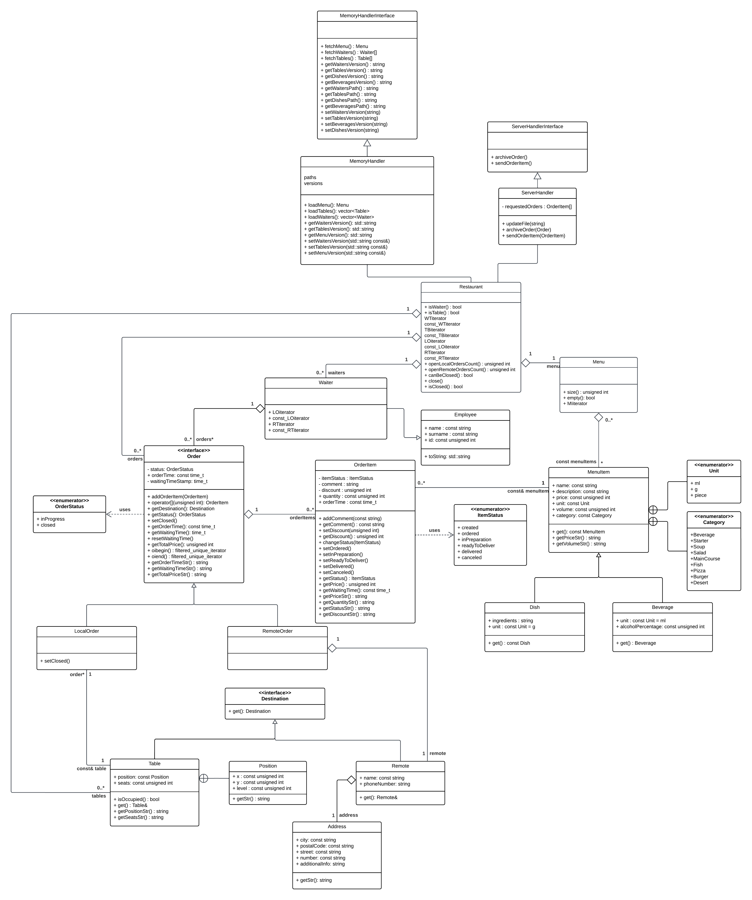

# Restaurant
## Dane autorów
- Michał Gryglicki
- Marcin Polewski

## Temat projektu
Celem projektu było stworzenie aplikacji typu POS(Point Of Sale) do obsługi zamówień przez kelnera. W tym celu stworzyliśmy bibliotekę ***restaurant***, zawierającą implementację poszczególnych klas(składowych) restauracji, wyróżnionych na diagramie UML zamieszczonym poniżej.

## Działanie
Aby uruchomić program, należy go skompilować, a następnie wykonać plik "gui.cpp". Po interfejsie należy poruszać się strzałkami, a zatwierdzać przyciskiem Enter. Na górze widoczny jest "TopBar", a na dole "MainScreen" zawierający stoliki. Na jego środku będą wyświetlane okienka. W przypadku uzyskania komunikatu o za małym oknie, należy je zwiększyć bądź zmniejszyć czcionkę terminala (Ctrl + '-'). Po poprawnym uruchomieniu powinien być widoczny ekran główny przedstawiający stoliki oraz pasek na górze (zwany dalej TopBar-em). Wszystkie dane są wczytywane z plików CSV zawartych w folderze memoryHandlerConf.

### TopBar zawiera przyciski do:
- zmiany profilu kelnera. Wszystkie wykonywane akcje będą przypisywane do tego kelnera, a w okienkach do przeglądu zamówień będą się wyświetlać tylko jego zamówienia. Każdy kelner jednak może wejść do dowolnego zamówienia przypisanego do stolika.
- przeglądu zamówień zdalnych przypisanych do kelnera, w nawiasie wyświetlana jest ich liczba.
- przeglądu zamówień lokalnych przypisanych do kelnera, w nawiasie wyświetlana jest ich liczba.
- przeglądania menu. Wyświetla się lista dostępnych elementów, a klikając na dany element, można uzyskać dodatkowe informacje.
- zamknięcia restauracji. Jest to możliwe tylko wtedy, kiedy nie ma aktualnie realizowanych zamówień - wszystkie muszą być zamknięte.

### Obsługa zamówień
Klikając na stolik, mamy dwie opcje. Jeśli do niego nie jest przypisane zamówienie, to zostaniemy o tym powiadomieni i zapytani, czy chcemy je utworzyć. W przeciwnym wypadku pokaże się widok zamówienia. Na górze zostaną wyświetlone podstawowe informacje, poniżej będzie lista zamówionych obiektów, która ma funkcjonalność scrolla, a na samym dole będą przyciski funkcyjne. Po kliknięciu na dany element zamówienia zostanie wyświetlony widok tego elementu, możemy zmienić jego status czy też dać zniżkę.

## Klasa ServerHandler
Jest to klasa stworzona głównie w celach pokazowych, tzn. w realnym zastosowaniu miałaby ona odpowiadać za komunikację z serwerem. Dokładniej, wysyłanie zamówionych rzeczy na serwer (które dalej byłyby przesyłane do kuchni) oraz archiwizowanie zamówień. Nie rozwijaliśmy jej dalej ze względu na to, że w tym miejscu postawiliśmy granicę naszego projektu.

## GUI
Interfejs graficzny został wykonany w ncurses. W pliku gui.cpp przechwytywane jest wejście użytkownika, a następnie przekierowywane do odpowiednich klas. Staraliśmy się zachować budowę modularną, która w łatwy sposób umożliwiła nam szybkie tworzenie kolejnych przycisków i wyskakujących okienek. Na szczególną uwagę zasługują klasy PopUpMenu i PopUpHandler. Pierwsza z nich jest klasą bazową dla poszczególnych menu w naszym interfejsie. W konstruktorze są definiowane przyciski, które muszą być umieszczone w odpowiedniej kolejności - najpierw przyciski scrolla, potem przyciski statyczne. Informacje tekstowe mogą znajdować się w dowolnym miejscu. Klasa PopUpHandler zarządza obiektami PopUpMenu. Tworzy i zamyka te obiekty. W klasie tej zastosowano strukturę stosu, co jest intuicyjne i efektywne. Niemniej jednak, takie podejście ma swoje ograniczenia - każde górne okno musi być mniejsze, ponieważ po dezaktywacji górnego okna nie można odświeżyć wszystkich pod nim. U nas została zachowana taka zasada z wyjątkiem wyskakujących błędów. Gdybyśmy mieli więcej czasu, zmienilibyśmy tę strukturę na wektor.

## Wnioski - Marcin
- Interfejs jest czasochłonnym elementem projektu i warto na niego zostawić dużo czasu, z pewnością więcej niż my. Naszym głównym celem było dopracowanie klas logiki, co moim zdaniem udało się osiągnąć, lecz implementacja warstwy wyświetlania na tym ucierpiała.
- Dobrze dobrana struktura jest kluczowa, a późniejsze nakładanie na nią interfejsu jest tylko przyjemnością.
- Wraz z partnerem, na początku, dobrze udało nam się ustalić wspólne cele, podział pracy, komunikację między klasami (diagram UML) i wspólne wzorce projektowe (struktura nazw plików, nazwy klas pisane od dużej litery itp.), co było jedną z lepszych naszych decyzji.

## Wnioski - Michał
Największą trudnością w tym projekcie było ustanowienie jego struktury. Od samego początku zależało nam na tym, aby nasze rozwiązanie było maksymalnie modularne i umożliwiało jego dalszy rozwój bez konieczności znacznej ingerencji w szkielet całej aplikacji. Wobec tego niektóre komponenty, mogą wydawać się zaimplementowane pozornie na wyrost, jednak dzięki temu w każdym momencie można je wymienić na bardziej wyspecjalizowane, wykonujące określone zadania. Nasz diagram UML zmieniał się i ewoluował aż do samego końca pracy. Jednak z każdą zmianą coraz bardziej się do niego przekonywaliśmy, a nasze pierwotne dosyć swobodne założenia ulegały konkretyzacji w coraz większym stopniu. O ile na początku pracy, było to kolokwialnie ujmując "błądzenie po omacku" o tyle pod koniec każdy z członków zespołu podzielał tą samą wizje rozwoju.

## zewnętrzne biblioteki
Do czytania plików .csv została wykorzystana poniższa biblioteka. Licencja została zawarta w pliku LICENSE.third-party.https://github.com/ben-strasser/fast-cpp-csv-parser.git

