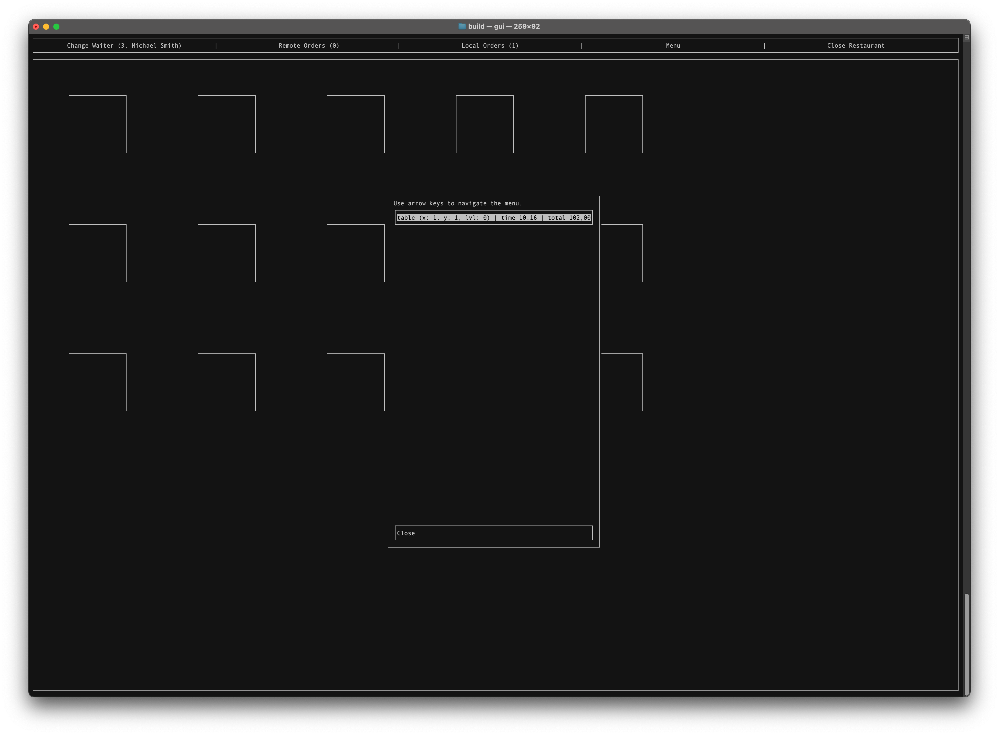

# Restaurant
## Author Information
- Michał Gryglicki
- Marcin Polewski

## Project Topic
The goal of the project was to create a POS (Point Of Sale) application for order management by a waiter. To achieve this, we created a library called ***restaurant***, containing implementations of various restaurant components, as shown in the UML diagram below.

## Functionality
To run the program, you need to compile it and then execute the "gui.cpp" file. Navigate the interface using the arrow keys and confirm actions with the Enter key. At the top, there is a "TopBar," and at the bottom, there is the "MainScreen" displaying the tables. In the center, pop-up windows will appear. If you receive a message about the window being too small, increase the window size or reduce the terminal font (Ctrl + '-'). Upon correct launch, the main screen should display tables and a top bar (referred to as TopBar). All data is loaded from CSV files contained in the memoryHandlerConf folder.

### TopBar includes buttons for:
- Changing the waiter profile. All actions will be assigned to this waiter, and only their orders will be displayed in the review windows. However, any waiter can access any order assigned to a table.
- Viewing remote orders assigned to the waiter, with the count displayed in parentheses.
- Viewing local orders assigned to the waiter, with the count displayed in parentheses.
- Browsing the menu. A list of available items is shown, and clicking on an item reveals additional information.
- Closing the restaurant. This is only possible when no orders are currently being processed – all orders must be closed.

### Order Management
Clicking on a table gives two options. If there is no order assigned to the table, you will be notified and asked if you want to create one. Otherwise, the order view will appear. At the top, basic information will be displayed, followed by a list of ordered items with scroll functionality, and functional buttons at the bottom. Clicking on an order item will display its details, allowing you to change its status or apply a discount.

## ServerHandler Class
This class was created mainly for demonstration purposes, i.e., in a real application, it would be responsible for communication with the server. Specifically, sending ordered items to the server (which would then be forwarded to the kitchen) and archiving orders. We did not develop this class further, as we set the boundary of our project here.

## GUI
The graphical interface was created using ncurses. In the gui.cpp file, user input is captured and then redirected to the appropriate classes. We aimed to maintain a modular structure, allowing us to quickly create additional buttons and pop-up windows. Noteworthy classes include PopUpMenu and PopUpHandler. The former is a base class for various menus in our interface. Buttons are defined in the constructor and must be placed in a specific order – scroll buttons first, followed by static buttons. Text information can be placed anywhere. The PopUpHandler class manages PopUpMenu objects, creating and closing these objects. A stack structure is used in this class, which is both intuitive and efficient. However, this approach has its limitations – each top window must be smaller because, after deactivating the top window, it is impossible to refresh all windows beneath it. This rule was maintained except for pop-up error messages. If we had more time, we would change this structure to a vector.

## Conclusions - Marcin
- The interface is a time-consuming part of the project, and it’s important to allocate more time to it, definitely more than we did. Our main goal was to perfect the logic classes, which I believe we achieved, but the implementation of the display layer suffered as a result.
- A well-chosen structure is key, and later layering the interface on top is only a pleasure.
- Together with my partner, we managed to establish shared goals, divide work, communicate between classes (UML diagram), and agree on common design patterns (file structure, class names starting with capital letters, etc.) early on, which was one of our best decisions.

## Conclusions - Michał
The biggest challenge in this project was establishing its structure. From the very beginning, we wanted our solution to be as modular as possible, allowing for future development without significant changes to the core framework. Therefore, some components may seem overly implemented, but this ensures that they can be replaced at any time with more specialized ones. Our UML diagram evolved until the very end of the project, but with each change, we became more convinced of its effectiveness, and our initial loose assumptions became more concrete. While at the start, it felt like "groping in the dark," by the end, every team member shared the same vision for development.

## External Libraries
The following library was used to read .csv files. The license is included in the LICENSE.third-party file. https://github.com/ben-strasser/fast-cpp-csv-parser.git

# Project Photos

